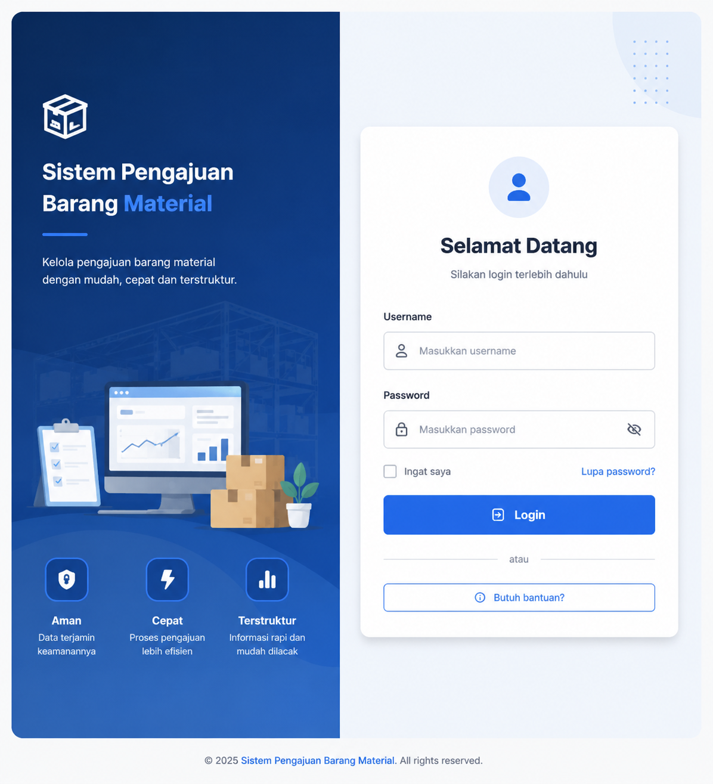
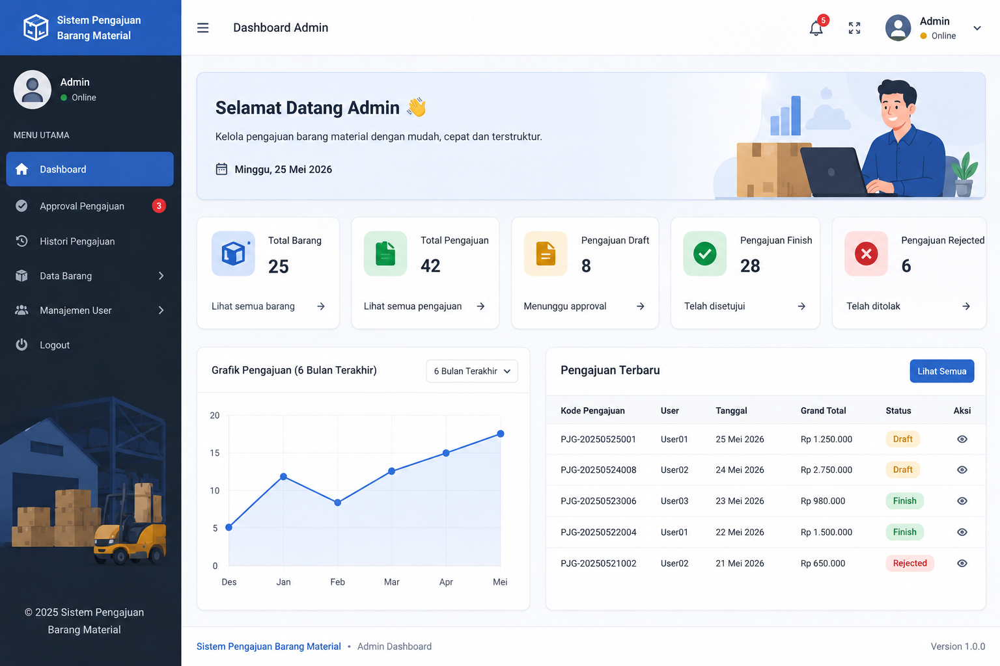
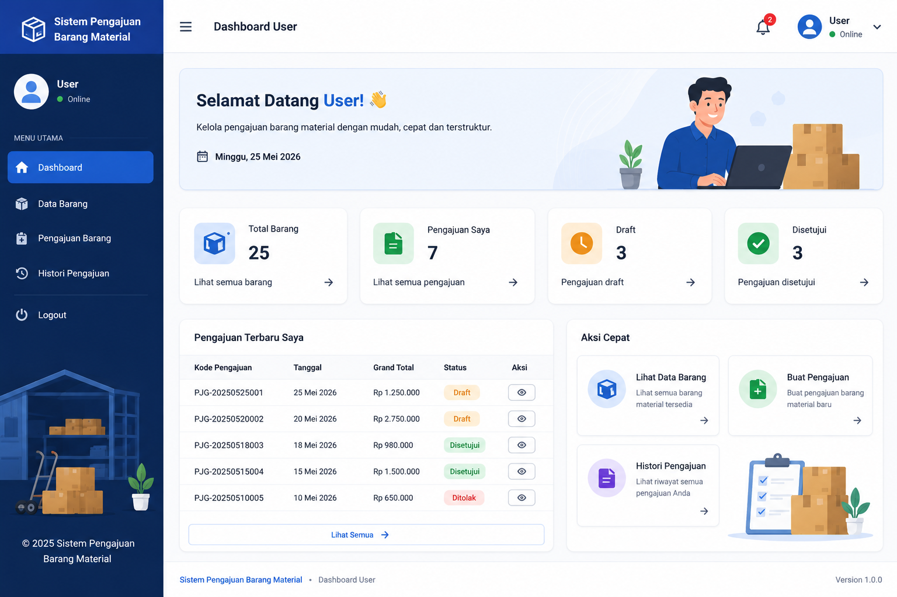

# Sistem Pengajuan Barang Material

Sistem Pengajuan Barang Material adalah aplikasi web berbasis **Python Flask** untuk mengelola data barang material, pengajuan barang, approval bertahap, histori pengajuan, tanda tangan digital, dan cetak PDF detail pengajuan. Aplikasi ini dirancang dengan tampilan dashboard modern menggunakan AdminLTE, Bootstrap, Font Awesome, dan CSS custom.

## Preview Aplikasi

### Login


### Dashboard Admin


### Dashboard User


## Fitur Utama

- Login multi-role menggunakan session Flask
- Dashboard berbeda untuk Admin, User, Accounting, dan Manager
- CRUD data barang material
- Form pengajuan barang dengan perhitungan subtotal dan grand total otomatis
- Monitoring flow approval untuk user
- Approval bertahap:
  - Admin approval awal
  - Accounting verifikasi dana
  - Manager approval akhir
- Tanda tangan digital untuk approval
- Histori pengajuan berdasarkan role
- Cetak PDF detail pengajuan menggunakan FPDF
- Proteksi halaman berdasarkan role pengguna
- Tampilan responsive, modern, clean, dan profesional

## Role dan Akun Login

| Role | Username | Password | Hak Akses |
| --- | --- | --- | --- |
| Admin | `admin` | `123` | Dashboard admin, approval awal, CRUD barang, histori, manajemen user |
| User | `user` | `123` | Dashboard user, melihat barang, membuat pengajuan, monitoring pengajuan, histori |
| Accounting | `akuntansi` | `a123` | Verifikasi dana, approval accounting, histori verifikasi |
| Manager | `manager` | `m123` | Approval akhir, histori approval manager |

> Catatan: akun di atas digunakan untuk kebutuhan praktik/development lokal. Untuk production, gunakan password yang kuat dan sistem hashing password.

## Alur Approval


Status yang dapat dipantau user:

- **Admin Pending**: Menunggu persetujuan admin
- **Admin Approved**: Admin sudah menyetujui
- **Accounting Pending**: Menunggu verifikasi dana Accounting
- **Accounting Approved**: Accounting sudah menyetujui dana
- **Manager Pending**: Menunggu approval Manager
- **Manager Approved**: Manager sudah menyetujui
- **Rejected**: Pengajuan tidak disetujui
- **Finish**: Pengajuan sudah disetujui sepenuhnya

## Teknologi

- Python Flask
- PyMySQL
- MySQL / MariaDB
- AdminLTE
- Bootstrap
- Font Awesome
- FPDF
- Laragon
- HTML, CSS, JavaScript

## Struktur Project

```text
flask_python6/
├── app.py
├── database.sql
├── requirements.txt
├── README.md
├── docs/
│   └── screenshots/
│       ├── login.png
│       ├── dashboard-admin.png
│       └── dashboard-user.png
├── static/
│   └── adminlte/
│       └── custom.css
└── templates/
    ├── login.html
    ├── dashboard_admin.html
    ├── dashboard_user.html
    ├── dashboard_accounting.html
    ├── dashboard_manager.html
    ├── barang.html
    ├── pengajuan_barang.html
    ├── approval_pengajuan.html
    ├── approval_accounting.html
    ├── approval_manager.html
    ├── histori_pengajuan_user.html
    ├── histori_pengajuan_admin.html
    ├── histori_accounting.html
    ├── histori_manager.html
    ├── tanda_tangan_pengajuan.html
    └── material/
        └── partials/
            ├── navbar.html
            ├── sidebar_admin.html
            ├── sidebar_user.html
            ├── sidebar_accounting.html
            └── sidebar_manager.html
```

## Instalasi dan Menjalankan Project

1. Clone repository:

```bash
git clone https://github.com/rahmawati6/flask-inventory-management.git
cd flask-inventory-management
```

2. Buat virtual environment:

```bash
python -m venv .venv
```

3. Aktifkan virtual environment:

```bash
.venv\Scripts\activate
```

4. Install dependency:

```bash
pip install -r requirements.txt
```

5. Pastikan MySQL/MariaDB di Laragon sudah aktif.

6. Jalankan aplikasi:

```bash
python app.py
```

7. Buka browser:

```text
http://127.0.0.1:5000
```

## Database

Database yang digunakan:

```text
flask_python6
```

Aplikasi akan membuat database, tabel, kolom tambahan, dan data awal secara otomatis saat `python app.py` dijalankan. File SQL juga tersedia pada:

```text
database.sql
```

## Modul Aplikasi

| Modul | Deskripsi |
| --- | --- |
| Login | Autentikasi multi-role menggunakan session Flask |
| Dashboard Admin | Statistik, approval awal, histori, dan manajemen data |
| Dashboard User | Pengajuan pribadi, monitoring flow approval, dan histori |
| Dashboard Accounting | Verifikasi dana dan histori approval dana |
| Dashboard Manager | Approval akhir dan monitoring pengajuan |
| Data Barang | CRUD barang untuk admin dan mode lihat untuk user |
| Pengajuan Barang | Form pengajuan dinamis dengan grand total otomatis |
| Approval | Approval bertahap dengan tanda tangan digital |
| Histori | Riwayat pengajuan sesuai role |
| PDF | Cetak detail pengajuan lengkap dengan status dan tanda tangan |

## Endpoint Penting

| Endpoint | Role | Fungsi |
| --- | --- | --- |
| `/login` | Semua | Login aplikasi |
| `/dashboard_admin` | Admin | Dashboard admin |
| `/dashboard_user` | User | Dashboard user |
| `/dashboard_accounting` | Accounting | Dashboard accounting |
| `/dashboard_manager` | Manager | Dashboard manager |
| `/barang` | Admin/User | Data barang |
| `/pengajuan_barang` | User | Form pengajuan barang |
| `/approval_pengajuan` | Admin | Approval awal admin |
| `/approval_accounting` | Accounting | Verifikasi dana |
| `/approval_manager` | Manager | Approval akhir |
| `/histori_pengajuan_user` | User | Histori dan monitoring pengajuan user |
| `/detail_pdf/<id_pengajuan>` | Login | Cetak PDF detail pengajuan |

## Catatan Pengembangan

- Project ini dibuat untuk pembelajaran Flask, MySQL, session login, role access, approval workflow, dan PDF generation.
- Password masih disimpan dalam bentuk plain text untuk kebutuhan praktik. Pada aplikasi production, gunakan hashing seperti `werkzeug.security`.
- Konfigurasi database berada di `app.py` dan secara default menggunakan user MySQL `root` tanpa password sesuai konfigurasi umum Laragon.
- Tanda tangan digital disimpan dalam format base64 pada database.

## Lisensi

Project ini dibuat untuk kebutuhan pembelajaran dan pengembangan aplikasi manajemen pengajuan barang material.
