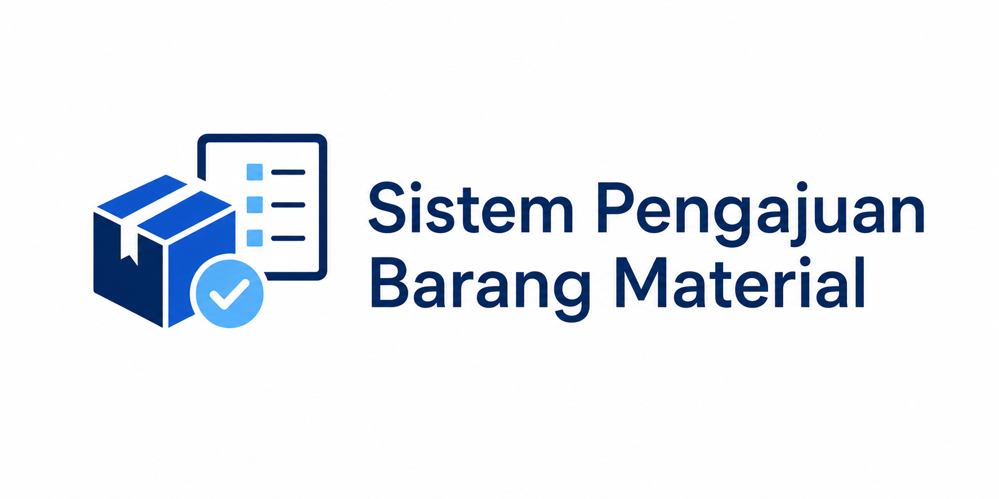
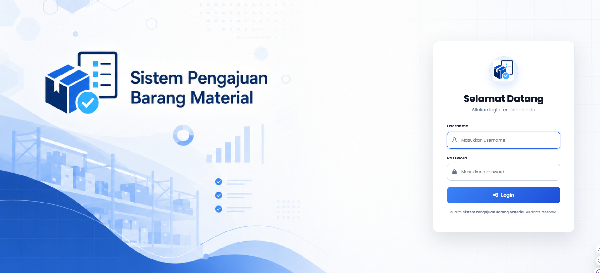
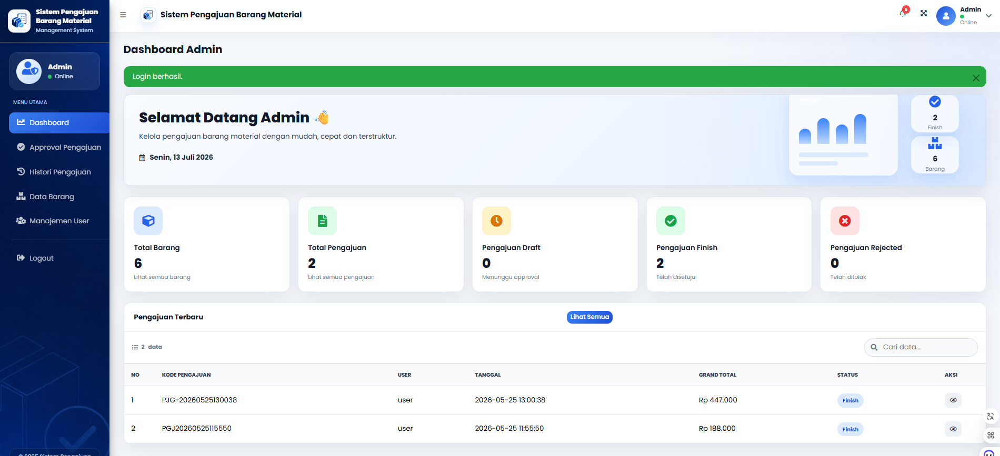
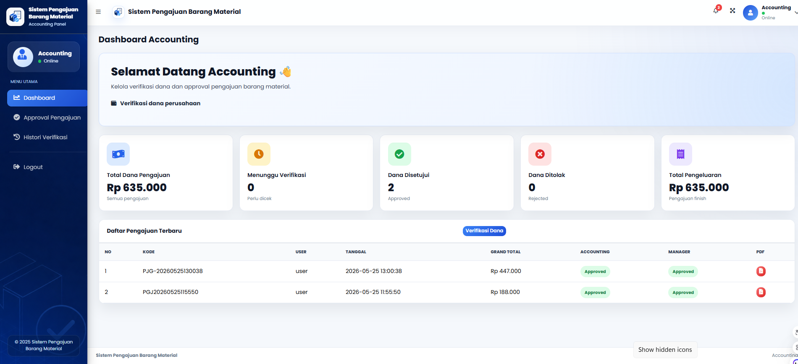
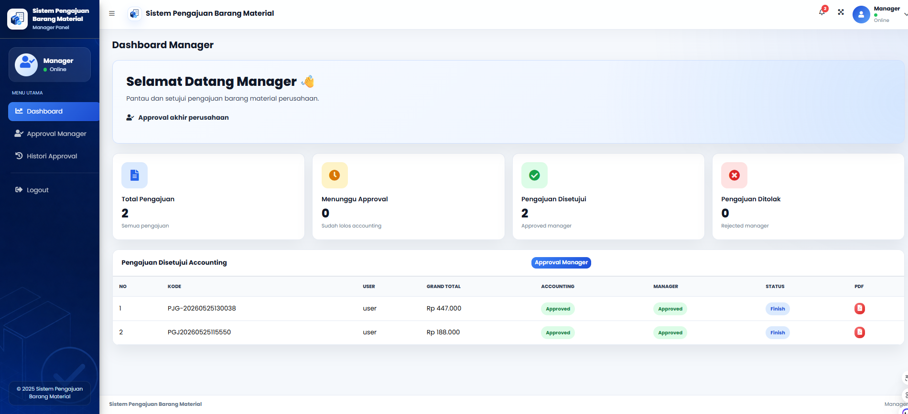
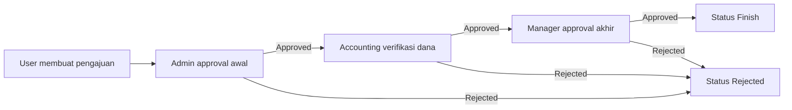

<p align="center">
  
</p>

<h1 align="center">Sistem Pengajuan Barang Material</h1>

<p align="center">
  Aplikasi dashboard management system berbasis Flask untuk mengelola barang material, pengajuan, approval bertahap, tanda tangan digital, histori, dan cetak PDF.
</p>

<p align="center">
  
  
  
  
</p>

---

## Overview

**Sistem Pengajuan Barang Material** adalah aplikasi web untuk membantu perusahaan mengelola pengajuan barang material secara terstruktur. Aplikasi ini mendukung multi-role, monitoring flow approval, approval bertahap, tanda tangan digital, dan cetak PDF detail pengajuan.

Project ini dibuat menggunakan **Python Flask**, **MySQL/MariaDB**, **AdminLTE**, **Bootstrap**, **Font Awesome**, dan **FPDF** dengan tampilan modern, clean, responsive, dan profesional.

## Preview Aplikasi

### Login


### Dashboard User


### Dashboard Admin


### Dashboard Accounting


### Dashboard Manager


## Fitur Utama

- Login multi-role menggunakan session Flask.
- Dashboard berbeda untuk Admin, User, Accounting, dan Manager.
- Proteksi halaman berdasarkan role pengguna.
- CRUD data barang material.
- Form pengajuan barang dengan subtotal dan grand total otomatis.
- Monitoring flow approval pada dashboard dan histori user.
- Approval bertahap dari Admin, Accounting, hingga Manager.
- Tanda tangan digital untuk proses approval.
- Histori pengajuan sesuai role.
- Cetak PDF detail pengajuan menggunakan FPDF.
- UI responsive dengan sidebar modern, card statistik, badge status, tabel modern, dan soft shadow.

## Role dan Akun Development

| Role | Username | Password | Hak Akses |
| --- | --- | --- | --- |
| Admin | `admin` | `123` | Dashboard admin, approval awal, CRUD barang, histori pengajuan, manajemen user |
| User | `user` | `123` | Dashboard user, data barang, membuat pengajuan, monitoring progress, histori |
| Accounting | `akuntansi` | `a123` | Verifikasi dana, approval accounting, histori verifikasi |
| Manager | `manager` | `m123` | Approval akhir dan histori approval manager |

> Akun di atas disediakan untuk kebutuhan development lokal. Untuk production, gunakan password hashing dan credential yang lebih aman.

## Alur Approval



Status yang dapat dipantau user:

- **Admin Pending**: Menunggu persetujuan Admin.
- **Admin Approved**: Admin sudah menyetujui.
- **Accounting Pending**: Menunggu verifikasi dana Accounting.
- **Accounting Approved**: Accounting sudah menyetujui dana.
- **Manager Pending**: Menunggu approval Manager.
- **Manager Approved**: Manager sudah menyetujui.
- **Rejected**: Pengajuan tidak disetujui.
- **Finish**: Pengajuan sudah disetujui sepenuhnya.

## Teknologi

| Kategori | Teknologi |
| --- | --- |
| Backend | Python Flask |
| Database | MySQL / MariaDB |
| Connector | PyMySQL / MySQL client |
| UI Template | AdminLTE |
| Frontend | Bootstrap, Font Awesome, HTML, CSS, JavaScript |
| PDF | FPDF |
| Local Server | Laragon |

## Struktur Project

```text
flask_python6/
|-- app.py
|-- database.sql
|-- requirements.txt
|-- README.md
|-- LICENSE
|-- docs/
|   `-- screenshots/
|       |-- login-20260713.png
|       |-- dashboard-user-20260713.png
|       |-- dashboard-admin-20260713.png
|       |-- dashboard-accounting-20260713.png
|       `-- dashboard-manager-20260713.png
|-- static/
|   `-- adminlte/
|       |-- custom.css
|       |-- app-ui.js
|       |-- logo-material.png
|       |-- logo-mark.png
|       |-- login-background.png
|       `-- sidebar-background.png
`-- templates/
    |-- login.html
    |-- dashboard_admin.html
    |-- dashboard_user.html
    |-- dashboard_accounting.html
    |-- dashboard_manager.html
    |-- barang.html
    |-- pengajuan_barang.html
    |-- approval_pengajuan.html
    |-- approval_accounting.html
    |-- approval_manager.html
    |-- histori_pengajuan_user.html
    |-- histori_pengajuan_admin.html
    |-- histori_accounting.html
    |-- histori_manager.html
    |-- tanda_tangan_pengajuan.html
    `-- material/
        `-- partials/
            |-- navbar.html
            |-- sidebar_admin.html
            |-- sidebar_user.html
            |-- sidebar_accounting.html
            `-- sidebar_manager.html
```

## Instalasi

1. Clone repository:

```bash
git clone https://github.com/rahmawati6/flask-inventory-management.git
cd flask-inventory-management
```

2. Buat virtual environment:

```bash
python -m venv .venv
```

3. Aktifkan virtual environment di Windows:

```bash
.venv\Scripts\activate
```

4. Install dependency:

```bash
pip install -r requirements.txt
```

5. Pastikan MySQL/MariaDB di Laragon sudah aktif.

6. Jalankan aplikasi:

```bash
python app.py
```

7. Buka aplikasi di browser:

```text
http://127.0.0.1:5000
```

## Database

Database yang digunakan:

```text
flask_python6
```

Aplikasi dapat membuat database, tabel, kolom tambahan, dan data awal saat `python app.py` dijalankan. File SQL juga tersedia pada:

```text
database.sql
```

## Modul Aplikasi

| Modul | Deskripsi |
| --- | --- |
| Login | Autentikasi multi-role menggunakan session Flask |
| Dashboard Admin | Statistik, approval awal, histori, data barang, dan manajemen user |
| Dashboard User | Statistik personal, monitoring approval, histori pengajuan, dan quick action |
| Dashboard Accounting | Verifikasi dana, approval accounting, dan histori verifikasi |
| Dashboard Manager | Approval akhir dan histori approval manager |
| Data Barang | CRUD barang untuk admin dan mode lihat untuk user |
| Pengajuan Barang | Form pengajuan dinamis dengan grand total otomatis |
| Approval Flow | Approval bertahap Admin, Accounting, dan Manager |
| Histori | Riwayat pengajuan berdasarkan role |
| PDF | Cetak detail pengajuan lengkap dengan status dan tanda tangan digital |

## Endpoint Penting

| Endpoint | Role | Fungsi |
| --- | --- | --- |
| `/login` | Semua | Login aplikasi |
| `/dashboard_admin` | Admin | Dashboard admin |
| `/dashboard_user` | User | Dashboard user |
| `/dashboard_accounting` | Accounting | Dashboard accounting |
| `/dashboard_manager` | Manager | Dashboard manager |
| `/barang` | Admin/User | Data barang |
| `/pengajuan_barang` | User | Form pengajuan barang |
| `/approval_pengajuan` | Admin | Approval awal admin |
| `/approval_accounting` | Accounting | Verifikasi dana |
| `/approval_manager` | Manager | Approval akhir |
| `/histori_pengajuan_user` | User | Histori dan monitoring pengajuan user |
| `/histori_pengajuan_admin` | Admin | Histori pengajuan admin |
| `/detail_pdf/<id_pengajuan>` | Login | Cetak PDF detail pengajuan |

## Catatan Pengembangan

- Project ini dibuat untuk pembelajaran Flask, MySQL, session login, role access, approval workflow, tanda tangan digital, dan PDF generation.
- Password masih disimpan dalam bentuk plain text untuk kebutuhan praktik. Pada aplikasi production, gunakan hashing seperti `werkzeug.security`.
- Konfigurasi database berada di `app.py` dan secara default menggunakan user MySQL `root` tanpa password sesuai konfigurasi umum Laragon.
- Tanda tangan digital disimpan dalam format base64 pada database.

## License

Project ini dirilis menggunakan lisensi **MIT License**. Lihat file [LICENSE](LICENSE) untuk detail lengkap.
